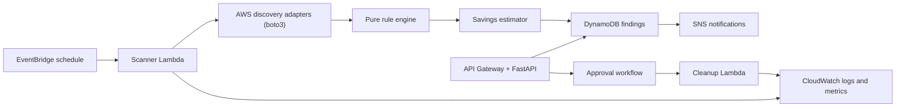

# AWS Cost Optimization Automation System

[](https://github.com/parthgenx/AWS-cost-optimizer/actions/workflows/ci.yml)

A production-minded AWS cost-optimization platform that identifies avoidable cloud spend, estimates potential monthly savings, and supports safe, approval-gated cleanup workflows.

> Current status: active development. Storage and public-IP detection, durable
> finding records, scheduled scans, notifications, approval auditing, a
> dry-run-first EBS cleanup worker, and CloudWatch-backed EC2, RDS, and
> Application Load Balancer recommendations and Cognito-protected API access
> are implemented. Operational monitoring, CI/CD deployment automation, and
> runbooks remain in progress.

## Problem

AWS accounts often retain resources that continue to incur cost after their original purpose has ended: unattached storage, unused public IPs, old snapshots, idle compute, databases, and load balancers.

Manual reviews are error-prone, while automatic deletion is risky. This platform aims to automate the safe middle ground:

```text
Discover → Evaluate → Estimate savings → Record finding → Notify → Approve → Revalidate → Clean up
```

Every destructive action will require explicit approval and a final live AWS-state check before execution.

## Planned capabilities

| Area | Capability | Status |
|---|---|---|
| Detection | Unattached EBS volumes | Implemented |
| Detection | Unassociated Elastic IPs | Implemented |
| Detection | Old manual EBS snapshots | Implemented (review-only) |
| Optimization | Low-utilization EC2 instances using CloudWatch evidence | Implemented (review-only) |
| Optimization | Low-utilization standalone RDS instances using CloudWatch evidence | Implemented (review-only) |
| Optimization | Application Load Balancers with no request evidence | Implemented (review-only) |
| Costing | Monthly savings estimates | EBS reference-rate estimate implemented |
| Persistence | Findings and scan-run records | Implemented |
| Safety | Resource exclusion tags | Implemented |
| Safety | Approval audit, explicit cleanup request, dry-run, and revalidation | Implemented for EBS |
| Operations | Scheduled scans, SNS finding notifications, retry/DLQ, and CloudWatch metrics | Implemented |

EC2, RDS, and load-balancer findings are recommendations—not automatic cleanup
candidates. Low activity does not prove that a production workload is safe to
remove.

Elastic IP and snapshot detection are also read-only. Only unattached EBS volumes currently have an approval-gated cleanup path.

## Target architecture



The code follows clear boundaries:

```text
API / worker handlers → application services → domain → infrastructure adapters
```

- **Domain:** pure models, policies, and rules; never imports boto3.
- **Application:** coordinates use cases such as scans and approvals.
- **Infrastructure:** contains boto3, DynamoDB, SNS, and EventBridge adapters.
- **API/workers:** thin HTTP and Lambda entry points.

The FastAPI application can run locally in trusted development mode, or as a
Lambda behind API Gateway. The deployed API is protected by Cognito-issued JWTs
and checks that the authenticated user belongs to the operator group before it
can approve a finding or request cleanup.

## Implemented: unattached EBS volume detection

The first detection rule identifies EBS volumes that are:

1. Currently in the AWS `available` state.
2. Older than a configurable minimum volume age; default: 14 days.
3. Not tagged with `cost-optimizer:exclude=true`.

The AWS adapter uses boto3’s paginated EC2 `describe_volumes` operation with a server-side `status=available` filter. Raw AWS responses are converted into typed domain models before evaluation.

Savings are estimated transparently:

```text
volume size (GiB) × configured reference monthly USD/GiB rate
```

Default reference rate: `$0.08/GiB-month`.

This is a visible estimate, not a billing-grade quote. Actual EBS pricing varies by region and volume type.

### Safety limitation

AWS does not expose the timestamp when an EBS volume became detached. The current rule means:

> “Currently unattached and old enough”

It does not claim that a volume has been unattached for the complete age threshold.

## Implemented: Elastic IP and EBS snapshot detection

### Unassociated Elastic IPs

The Elastic IP scanner calls boto3's paginated EC2 `describe_addresses` API and
flags an address only when AWS returns no association, network interface, or
instance identifier. The default reference estimate is `$3.60/month` per
address. This is an explicit estimate, not a billing quote; regional pricing
and IPv4 billing policies can change.

### Old manual EBS snapshots

The snapshot scanner uses paginated EC2 `describe_snapshots` calls scoped to
`OwnerIds=["self"]` and completed snapshots. It flags completed snapshots older
than 90 days unless excluded or identified as AMI-created from the documented
`Created by CreateImage(` description convention. These are **retention review
findings**, not a claim that a snapshot is unused.

No per-snapshot savings estimate is shown. EBS snapshot charges are based on
incremental stored blocks rather than a snapshot's source volume size, so
estimating cost from `VolumeSize` would be misleading.

## Implemented: utilization recommendations

The platform now adds three conservative, CloudWatch-backed rules. Each rule
uses complete UTC days only and excludes the current, partial day. A finding is
an investigation prompt, never an instruction to delete a workload.

### EC2: sustained low CPU and network activity

The EC2 scanner considers running instances older than the observation window.
It requires complete daily data for all three metrics: `CPUUtilization`,
`NetworkIn`, and `NetworkOut`. With the default 14-day window, it recommends
review only when every daily CPU maximum is at most 5% and total network traffic
is at most 1 GiB. An exclusion tag always wins.

### RDS: low utilization with no client connections

The RDS scanner considers only available, standalone instances that are older
than the observation window. It requires complete daily `CPUUtilization` and
`DatabaseConnections` data. By default, CPU must remain at or below 5% and the
maximum reported client connections must be zero. Multi-AZ, clustered, Aurora,
and read-replica topologies are deliberately excluded because they have a
higher risk of being a dependency or resilience component.

`DatabaseConnections` is only one signal: AWS defines it as client network
connections and excludes internal database connections. It therefore supports
human review rather than proving that a database is unused. [AWS RDS metrics](https://docs.aws.amazon.com/AmazonRDS/latest/UserGuide/rds-metrics.html)

### Application Load Balancers: no request evidence

The load-balancer scanner considers active Application Load Balancers older
than the observation window. It looks for no `RequestCount` metric data over
that entire period. AWS emits ALB metrics only when requests flow, and health
checks are excluded from this metric, so this is a useful but intentionally
non-destructive review signal. [AWS ALB metrics](https://docs.aws.amazon.com/elasticloadbalancing/latest/application/load-balancer-cloudwatch-metrics.html)

### Why no savings estimate yet?

The initial utilization rules intentionally do not estimate savings. Accurate
EC2, RDS, and load-balancer pricing depends on region, instance class, purchase
model, storage, data transfer, and other configuration. Showing a simplistic
number would make the finding look more certain than it is. A later pricing
integration can add estimates with an explicit methodology.

### Efficient CloudWatch access

Each scanner discovers resources with boto3, then requests daily CloudWatch
metrics in batches of up to 500 metric queries. This avoids one CloudWatch call
per resource per metric, while keeping CloudWatch and boto3 code outside the
business rules. The rule engine receives typed metric windows, so it remains
unit-testable without AWS credentials.

## Finding persistence

Findings use stable IDs based on the rule and AWS resource identity. Repeated scans update the existing finding instead of creating duplicates.

The system records:

- Finding ID, resource identity, severity, evidence, and savings estimate
- First and last observation time
- Number of times the finding has been observed
- Scan start/completion status
- Evaluated-resource and finding counts
- Sanitized failure type when a scan fails

DynamoDB writes are designed to be atomic and idempotent.

## Approval and safe EBS cleanup

Cleanup is intentionally a separate path from scanning. An operator first
approves an `open` finding, then makes a second, explicit cleanup request. The
request is published to EventBridge, which invokes a separate cleanup Lambda.
That Lambda has the only EBS delete permission; the scanner remains read-only.

Before deleting, the cleanup Lambda reloads the finding, confirms it is still
approved, re-fetches the exact EBS volume, and evaluates the existing rule
again. Dry-run is enabled by default. Real deletion requires both deployment
parameters below, so changing only one cannot enable deletion accidentally:

```text
CleanupDryRun=false CleanupExecutionEnabled=true
```

The local FastAPI application retains `X-Operator-ID` only for trusted
development and test execution. In a deployed environment, API Gateway
validates Cognito JWTs and FastAPI records the immutable JWT `sub` claim as the
operator identity. A caller-controlled header is rejected in production.

## Implemented: authenticated operational API

The deployment template creates a Cognito user pool with administrator-created
users only, an `cost-optimizer-operators` group, an API Gateway HTTP API JWT
authorizer, and a small Lambda adapter for FastAPI. Every API route requires a
valid JWT. FastAPI then confirms group membership before passing the verified
subject to the approval or cleanup-request service.

This gives the audit trail a meaningful actor identity without putting JWT
signature-verification code in the application. API Gateway validates token
signature, issuer, audience, and expiry before a request reaches Lambda, then
passes verified claims to the integration. [AWS API Gateway JWT authorizers](https://docs.aws.amazon.com/apigateway/latest/developerguide/http-api-jwt-authorizer.html)

See [API authentication decision](docs/decisions/0002-api-authentication.md)
for trade-offs and the safe operator-provisioning procedure.

## Technology stack

- Python 3.13+
- FastAPI
- boto3
- AWS Lambda
- API Gateway
- EventBridge
- DynamoDB
- SNS
- CloudWatch
- Docker
- GitHub Actions
- Ruff, mypy, pytest, and coverage

## Repository layout

```text
.
├── backend/
│   ├── src/cost_optimization/
│   │   ├── api/                  # FastAPI transport layer
│   │   ├── application/          # use cases
│   │   ├── domain/               # models, policies, ports, and rules
│   │   ├── infrastructure/       # AWS and persistence adapters
│   │   └── observability/        # JSON logs and correlation IDs
│   ├── tests/
│   ├── pyproject.toml
│   └── Dockerfile
├── docs/
├── .github/workflows/
├── docker-compose.yml
└── README.md
```

## Local development

### Prerequisites

- Python 3.13 or 3.14
- Docker (optional)

### Run the API

```bash
python3 -m venv .venv
.venv/bin/python -m pip install -e "backend[dev]"
.venv/bin/uvicorn cost_optimization.api.main:app --reload
```

Health endpoint:

```text
http://localhost:8000/health
```

### Run quality checks

```bash
cd backend
../.venv/bin/ruff format --check src tests
../.venv/bin/ruff check src tests
../.venv/bin/mypy src
../.venv/bin/pytest
```

The virtual environment is intentionally stored at the repository root, not in
`backend/`. AWS SAM treats `backend/` as Lambda deployment source, so keeping
developer-only dependencies outside it prevents local macOS files from entering
the Linux Lambda build.

## AWS development lifecycle: deploy, verify, and clean up

This section describes the complete development-environment lifecycle. The
application is deployed only when you explicitly run the deployment command;
Docker alone never creates AWS resources or AWS charges.

### Prerequisites

- Docker Desktop is running.
- The AWS CLI is authenticated to the AWS account you intend to scan.
- AWS SAM CLI is installed.
- Your selected region is `ap-south-1`, or you replace it consistently in the
  commands below.

Confirm the local tooling before deployment:

```bash
docker info
aws sts get-caller-identity
sam validate --template infrastructure/template.yaml
```

### Start a development deployment

From the repository root, build the Lambda package inside Docker. This is
required because Lambda runs Linux while local development may run on macOS.

```bash
SAM_CLI_TELEMETRY=0 sam build \
  --template-file infrastructure/template.yaml \
  --use-container
```

Deploy the built package. The command creates the `aws-cost-optimizer-dev`
CloudFormation stack, including six scanner Lambdas, an isolated cleanup Lambda,
a Cognito-protected FastAPI Lambda, DynamoDB tables, EventBridge rules,
operational alarms/dashboard, and CloudWatch log groups. Cleanup remains
dry-run-only by default.

```bash
SAM_CLI_TELEMETRY=0 sam deploy \
  --template-file .aws-sam/build/template.yaml \
  --stack-name aws-cost-optimizer-dev \
  --region ap-south-1 \
  --parameter-overrides Environment=dev \
  --capabilities CAPABILITY_IAM \
  --resolve-s3 \
  --no-confirm-changeset
```

`--resolve-s3` lets SAM create or reuse its deployment-artifact bucket. The
bucket is not an application runtime service. SAM removes this application's
artifacts during cleanup; an empty shared bucket does not incur S3 storage
charges.

The deployed API endpoint and Cognito IDs are CloudFormation outputs. The API
is intentionally not anonymously accessible: create an administrator-provisioned
Cognito user and add it to `cost-optimizer-operators` before making approval or
cleanup-request calls. See the [API authentication decision](docs/decisions/0002-api-authentication.md).

Scheduled scans are disabled by default. To enable the weekly EventBridge scans
and subscribe an email recipient to finding notifications, add these parameter
overrides to the deployment command:

```bash
--parameter-overrides \
  'Environment=dev ScheduledScansEnabled=true NotificationEmail=operator@example.com'
```

The recipient must confirm the SNS email subscription. Notifications are sent
only when a scan finds potential savings. Failed scheduled invocations are
retried by EventBridge and then placed in the SQS dead-letter queue.

To override the schedule, keep the complete override string quoted because an
EventBridge expression contains spaces:

```bash
--parameter-overrides \
  'Environment=dev ScheduledScansEnabled=true ScanScheduleExpression="rate(1 hour)"'
```

### Verify one scan

Invoke the scanner once, then read the Lambda response:

```bash
aws lambda invoke \
  --function-name aws-cost-optimizer-ebs-scanner-dev \
  --region ap-south-1 \
  --cli-binary-format raw-in-base64-out \
  --payload '{}' \
  /tmp/ebs-scan-response.json

cat /tmp/ebs-scan-response.json
```

To inspect the structured logs in CloudWatch from the terminal:

```bash
aws logs tail /aws/lambda/aws-cost-optimizer-ebs-scanner-dev \
  --region ap-south-1 \
  --since 10m
```

### Stop AWS resources and ongoing project charges

When you are finished testing, run:

```bash
./scripts/cleanup-dev.sh --region ap-south-1
```

The script displays the target account and asks you to type `DELETE`. It then
removes the complete `aws-cost-optimizer-dev` stack and its SAM-managed
deployment artifacts, and verifies that the stack no longer exists. It removes
all AWS resources created by this project in that region.

AWS billing data can be delayed, so a final charge for time already used may
appear later. After successful cleanup, however, no deployed project resources
remain to generate ongoing charges.

### Docker and local cleanup

SAM creates a short-lived Docker build container. It exits automatically when
`sam build --use-container` finishes, so there is no Docker container to keep
running or stop later. Docker images and `.aws-sam/` build artifacts remain on
your computer only; they use local disk space and never create AWS charges.

Optional local-disk cleanup, run from the repository root:

```bash
docker image rm public.ecr.aws/sam/build-python3.13:latest-arm64
rm -rf .aws-sam
```

These commands remove only the cached Lambda build image and local SAM build
output. They do not change AWS resources or source code.

### Start again after cleanup

There is nothing to "turn back on." Open Docker Desktop, authenticate the AWS
CLI if necessary, then repeat the **Start a development deployment** commands.
CloudFormation recreates a fresh development environment from
`infrastructure/template.yaml`.

## Configuration

| Variable | Default | Purpose |
|---|---:|---|
| `COST_OPTIMIZER_ENVIRONMENT` | `development` | Runtime environment |
| `COST_OPTIMIZER_LOG_LEVEL` | `INFO` | Structured logging threshold |
| `COST_OPTIMIZER_EBS_UNATTACHED_MINIMUM_VOLUME_AGE_DAYS` | `14` | Minimum EBS volume age |
| `COST_OPTIMIZER_EBS_REFERENCE_GIB_MONTHLY_RATE_USD` | `0.08` | Reference EBS savings rate |
| `COST_OPTIMIZER_UTILIZATION_LOOKBACK_DAYS` | `14` | Complete UTC days required for utilization recommendations |
| `COST_OPTIMIZER_EC2_MAXIMUM_CPU_PERCENT` | `5` | Maximum daily EC2 CPU percentage |
| `COST_OPTIMIZER_EC2_MAXIMUM_TOTAL_NETWORK_BYTES` | `1073741824` | Maximum combined EC2 network bytes across the window |
| `COST_OPTIMIZER_RDS_MAXIMUM_CPU_PERCENT` | `5` | Maximum daily RDS CPU percentage |

## Security and safety principles

- No automatic deletion.
- Explicit approval before destructive actions.
- Revalidation immediately before cleanup.
- Dry-run support for destructive workflows.
- `cost-optimizer:exclude=true` prevents a resource from becoming a finding.
- Separate least-privilege IAM roles for API, scanner, and cleanup workloads.
- Cognito JWT validation at API Gateway; group-based operator authorization in FastAPI.
- No long-lived AWS credentials in GitHub Actions; use OIDC deployment roles.

## Roadmap

1. Deploy DynamoDB tables and wire scanner Lambda handlers.
2. Add EventBridge schedules, SNS notifications, CloudWatch metrics, retries, and dead-letter handling.
3. Add approval, audit, dry-run, and safe cleanup workflows.
4. Add Elastic IP and EBS snapshot detection.
5. Add CloudWatch-backed EC2, RDS, and load-balancer recommendations. ✅
6. Add Cognito authorization, monitoring dashboards, runbooks, and sandbox end-to-end tests. In progress: Cognito authorization is complete.

## Documentation

- [Architecture](docs/architecture.md)
- [Milestone plan](docs/milestones.md)
- [Layered backend decision record](docs/decisions/0001-layered-backend.md)
- [API authentication decision](docs/decisions/0002-api-authentication.md)
- [Operations runbook](docs/operations.md)
- [CI/CD and GitHub OIDC deployment](docs/ci-cd.md)
- [Threat model](docs/threat-model.md)
- [Unattached EBS volume rule](docs/rules/unattached-ebs-volumes.md)
- [Utilization recommendation rules](docs/rules/utilization-recommendations.md)
- [Deployment foundation](docs/deployment.md)

## Development workflow

`main` contains reviewed, stable milestones. New work is developed on focused feature branches, reviewed through pull requests, and merged into `main`.

## License

No license file is present in the current repository.
