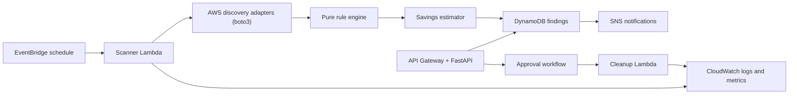

# AWS Cost Optimization Automation System

[](https://github.com/parthgenx/AWS-cost-optimizer/actions/workflows/ci.yml)

A production-minded AWS cost-optimization platform that identifies avoidable cloud spend, estimates potential monthly savings, and supports safe, approval-gated cleanup workflows.

> Current status: active development. The project includes a tested EBS detection foundation and durable finding/scan-record persistence. AWS infrastructure deployment, scheduled scans, notifications, and cleanup actions are still in progress.

## Problem

AWS accounts often retain resources that continue to incur cost after their original purpose has ended: unattached storage, unused public IPs, old snapshots, idle compute, databases, and load balancers.

Manual reviews are error-prone, while automatic deletion is risky. This platform aims to automate the safe middle ground:

```text
Discover → Evaluate → Estimate savings → Record finding → Notify → Approve → Revalidate → Clean up
```

Every destructive action will require explicit approval and a final live AWS-state check before execution.

## Planned capabilities

| Area | Capability | Status |
|---|---|---|
| Detection | Unattached EBS volumes | Implemented |
| Detection | Unassociated Elastic IPs | Planned |
| Detection | Old EBS snapshots | Planned |
| Optimization | Idle EC2 instances using CloudWatch evidence | Planned |
| Optimization | Idle RDS instances using CloudWatch evidence | Planned |
| Optimization | Idle load balancers using CloudWatch evidence | Planned |
| Costing | Monthly savings estimates | EBS reference-rate estimate implemented |
| Persistence | Findings and scan-run records | Implemented |
| Safety | Resource exclusion tags | Implemented |
| Safety | Approval, dry-run, and revalidation | Planned |
| Operations | EventBridge, SNS, and CloudWatch integration | Planned |

EC2, RDS, and load-balancer findings will be recommendations—not automatic cleanup candidates. Low activity does not prove that a production workload is safe to remove.

## Target architecture



The code follows clear boundaries:

```text
API / worker handlers → application services → domain → infrastructure adapters
```

- **Domain:** pure models, policies, and rules; never imports boto3.
- **Application:** coordinates use cases such as scans and approvals.
- **Infrastructure:** contains boto3, DynamoDB, SNS, and EventBridge adapters.
- **API/workers:** thin HTTP and Lambda entry points.

## Implemented: unattached EBS volume detection

The first detection rule identifies EBS volumes that are:

1. Currently in the AWS `available` state.
2. Older than a configurable minimum volume age; default: 14 days.
3. Not tagged with `cost-optimizer:exclude=true`.

The AWS adapter uses boto3’s paginated EC2 `describe_volumes` operation with a server-side `status=available` filter. Raw AWS responses are converted into typed domain models before evaluation.

Savings are estimated transparently:

```text
volume size (GiB) × configured reference monthly USD/GiB rate
```

Default reference rate: `$0.08/GiB-month`.

This is a visible estimate, not a billing-grade quote. Actual EBS pricing varies by region and volume type.

### Safety limitation

AWS does not expose the timestamp when an EBS volume became detached. The current rule means:

> “Currently unattached and old enough”

It does not claim that a volume has been unattached for the complete age threshold.

## Finding persistence

Findings use stable IDs based on the rule and AWS resource identity. Repeated scans update the existing finding instead of creating duplicates.

The system records:

- Finding ID, resource identity, severity, evidence, and savings estimate
- First and last observation time
- Number of times the finding has been observed
- Scan start/completion status
- Evaluated-resource and finding counts
- Sanitized failure type when a scan fails

DynamoDB writes are designed to be atomic and idempotent.

## Technology stack

- Python 3.13+
- FastAPI
- boto3
- AWS Lambda
- API Gateway
- EventBridge
- DynamoDB
- SNS
- CloudWatch
- Docker
- GitHub Actions
- Ruff, mypy, pytest, and coverage

## Repository layout

```text
.
├── backend/
│   ├── src/cost_optimization/
│   │   ├── api/                  # FastAPI transport layer
│   │   ├── application/          # use cases
│   │   ├── domain/               # models, policies, ports, and rules
│   │   ├── infrastructure/       # AWS and persistence adapters
│   │   └── observability/        # JSON logs and correlation IDs
│   ├── tests/
│   ├── pyproject.toml
│   └── Dockerfile
├── docs/
├── .github/workflows/
├── docker-compose.yml
└── README.md
```

## Local development

### Prerequisites

- Python 3.13 or 3.14
- Docker (optional)

### Run the API

```bash
cd backend
python -m venv .venv
.venv/bin/python -m pip install -e ".[dev]"
.venv/bin/uvicorn cost_optimization.api.main:app --reload
```

Health endpoint:

```text
http://localhost:8000/health
```

### Run quality checks

```bash
cd backend
.venv/bin/ruff format --check src tests
.venv/bin/ruff check src tests
.venv/bin/mypy src
.venv/bin/pytest
```

## Configuration

| Variable | Default | Purpose |
|---|---:|---|
| `COST_OPTIMIZER_ENVIRONMENT` | `development` | Runtime environment |
| `COST_OPTIMIZER_LOG_LEVEL` | `INFO` | Structured logging threshold |
| `COST_OPTIMIZER_EBS_UNATTACHED_MINIMUM_VOLUME_AGE_DAYS` | `14` | Minimum EBS volume age |
| `COST_OPTIMIZER_EBS_REFERENCE_GIB_MONTHLY_RATE_USD` | `0.08` | Reference EBS savings rate |

## Security and safety principles

- No automatic deletion.
- Explicit approval before destructive actions.
- Revalidation immediately before cleanup.
- Dry-run support for destructive workflows.
- `cost-optimizer:exclude=true` prevents a resource from becoming a finding.
- Separate least-privilege IAM roles for API, scanner, and cleanup workloads.
- No long-lived AWS credentials in GitHub Actions; use OIDC deployment roles.

## Roadmap

1. Deploy DynamoDB tables and wire scanner Lambda handlers.
2. Add EventBridge schedules, SNS notifications, CloudWatch metrics, retries, and dead-letter handling.
3. Add approval, audit, dry-run, and safe cleanup workflows.
4. Add Elastic IP and EBS snapshot detection.
5. Add CloudWatch-backed EC2, RDS, and load-balancer recommendations.
6. Add Cognito authorization, monitoring dashboards, runbooks, and sandbox end-to-end tests.

## Documentation

- [Architecture](docs/architecture.md)
- [Milestone plan](docs/milestones.md)
- [Layered backend decision record](docs/decisions/0001-layered-backend.md)
- [Unattached EBS volume rule](docs/rules/unattached-ebs-volumes.md)
- [Deployment foundation](docs/deployment.md)

## Development workflow

`main` contains reviewed, stable milestones. New work is developed on focused feature branches, reviewed through pull requests, and merged into `main`.

## License

No license file is present in the current repository.
